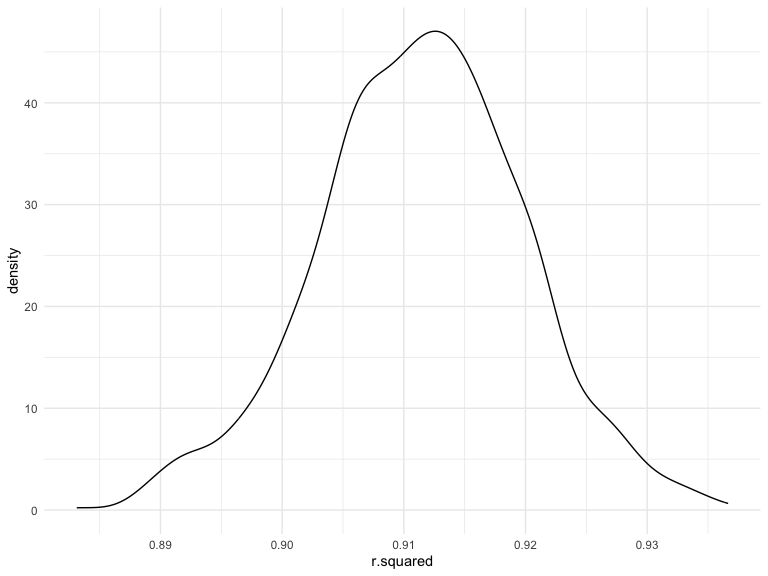
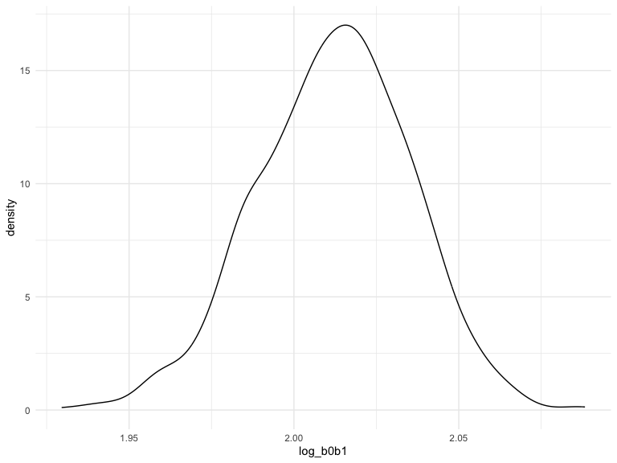
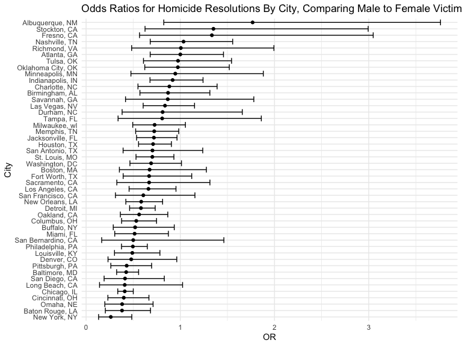
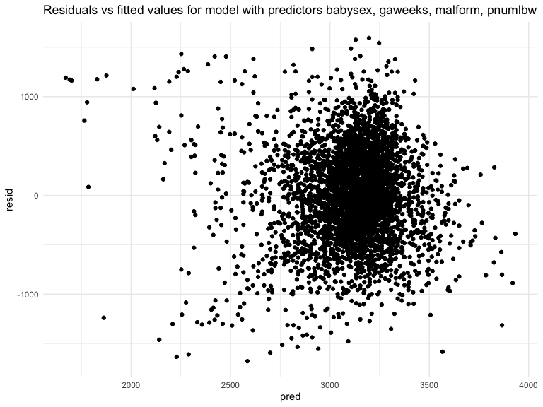
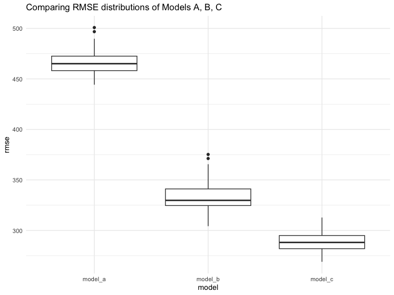

Homework 6
================
Juan Cambeiro
2022-12-03

### Problem 1

To obtain a distribution for $\hat{r}^2$, we’ll follow basically the
same procedure we used for regression coefficients: draw bootstrap
samples; the a model to each; extract the value I’m concerned with; and
summarize. Here, we’ll use `modelr::bootstrap` to draw the samples and
`broom::glance` to produce `r.squared` values.

``` r
weather_df = 
  rnoaa::meteo_pull_monitors(
    c("USW00094728"),
    var = c("PRCP", "TMIN", "TMAX"), 
    date_min = "2017-01-01",
    date_max = "2017-12-31") %>%
  mutate(
    name = recode(id, USW00094728 = "CentralPark_NY"),
    tmin = tmin / 10,
    tmax = tmax / 10) %>%
  select(name, id, everything())
```

    ## Registered S3 method overwritten by 'hoardr':
    ##   method           from
    ##   print.cache_info httr

    ## using cached file: ~/Library/Caches/R/noaa_ghcnd/USW00094728.dly

    ## date created (size, mb): 2022-10-24 08:19:39 (8.411)

    ## file min/max dates: 1869-01-01 / 2022-10-31

``` r
weather_df %>% 
  modelr::bootstrap(n = 1000) %>% 
  mutate(
    models = map(strap, ~lm(tmax ~ tmin, data = .x) ),
    results = map(models, broom::glance)) %>% 
  select(-strap, -models) %>% 
  unnest(results) %>% 
  ggplot(aes(x = r.squared)) + geom_density()
```



In this example, the $\hat{r}^2$ value is high, and the upper bound at 1
may be a cause for the generally skewed shape of the distribution. If we
wanted to construct a confidence interval for $R^2$, we could take the
2.5% and 97.5% quantiles of the estimates across bootstrap samples.
However, because the shape isn’t symmetric, using the mean +/- 1.96
times the standard error probably wouldn’t work well.

We can produce a distribution for $\log(\beta_0 * \beta1)$ using a
similar approach, with a bit more wrangling before we make our plot.

``` r
weather_df %>% 
  modelr::bootstrap(n = 1000) %>% 
  mutate(
    models = map(strap, ~lm(tmax ~ tmin, data = .x) ),
    results = map(models, broom::tidy)) %>% 
  select(-strap, -models) %>% 
  unnest(results) %>% 
  select(id = `.id`, term, estimate) %>% 
  pivot_wider(
    names_from = term, 
    values_from = estimate) %>% 
  rename(beta0 = `(Intercept)`, beta1 = tmin) %>% 
  mutate(log_b0b1 = log(beta0 * beta1)) %>% 
  ggplot(aes(x = log_b0b1)) + geom_density()
```



As with $r^2$, this distribution is somewhat skewed and has some
outliers.

The point of this is not to say you should always use the bootstrap –
it’s possible to establish “large sample” distributions for strange
parameters / values / summaries in a lot of cases, and those are great
to have. But it is helpful to know that there’s a way to do inference
even in tough cases.

### Problem 2

First, I will load and clean the homicide data that was gathered by The
Washington Post and describe the raw data.

``` r
homicide =
  read_csv("data/homicide-data.csv") %>%
  janitor::clean_names()
```

    ## Rows: 52179 Columns: 12
    ## ── Column specification ────────────────────────────────────────────────────────
    ## Delimiter: ","
    ## chr (9): uid, victim_last, victim_first, victim_race, victim_age, victim_sex...
    ## dbl (3): reported_date, lat, lon
    ## 
    ## ℹ Use `spec()` to retrieve the full column specification for this data.
    ## ℹ Specify the column types or set `show_col_types = FALSE` to quiet this message.

**Description of raw data:** There are 52179 observations and 12
variables in the dataset.

Next, I will tidy the data by using `mutate` to make a `city_state`
variable and I will also make a binary `resolved` variable to indicate
whether a homicide is resolved (1 for solved, 0 for not solved). I also
ensure appropriate data types are used. I use `filter` to omit the
following cities: Dallas, TX; Phoenix, AZ; Kansas City, MO; Tulsa, AL. I
also use `filter` to limit the analysis to those victim_race is White or
Black.

``` r
homicide_tidy = homicide %>%
  mutate(city_state = as.factor(str_c(city, state, sep = ", ")), 
         resolved = if_else(disposition == "Closed by arrest", 1, 0),
         reported_date = as.Date(as.character(reported_date),"%Y%m%d"), 
         victim_age = as.numeric(victim_age), 
         victim_sex = as.factor(victim_sex),
         victim_race = as.factor(victim_race), 
         city = as.factor(city),
         state = as.factor(state)) %>%
  filter(city_state != "Dallas, TX",
         city_state != "Phoenix, AZ", 
         city_state != "Kansas City,MO", 
         city_state != "Tulsa, AL") %>% 
  filter(victim_race == "White" | victim_race == "Black")
```

**Description of tidied data:** There are now 39693 observations and 14
variables in the dataset.

Now, I use the `glm` function to fit a logistic regression for
Baltimore, MD with the binary `resolved` variable as the outcome and
`victim_age`, `victim_sex`, and `victim_race` as predictors. I save the
output as an R object, apply `broom::tidy`, and obtain the estimate and
confidence interval of the adjusted OR for homicides resolved comparing
male victims to female victims.

``` r
baltimore_glm =
  homicide_tidy %>%
  filter(city_state == "Baltimore, MD")
output = glm(resolved ~ victim_age + victim_sex + victim_race, data = baltimore_glm, family = "binomial") %>% 
  tidy(exponentiate = 1, conf.int = 1, conf.level = 0.95) %>%
  filter(term == "victim_sexMale") %>%
  select(term, estimate, conf.low, conf.high)
output
```

    ## # A tibble: 1 × 4
    ##   term           estimate conf.low conf.high
    ##   <chr>             <dbl>    <dbl>     <dbl>
    ## 1 victim_sexMale    0.426    0.324     0.558

**Adjusted OR for solving homicides in Baltimore, comparing male victims
to female victims:** 0.426 (95% CI: 0.324, 0.558)

Next, I run `glm` for each of the cities in my dataset to extract the
adjusted ORs and corresponding CIs for solving homicides comparing male
victims and female victims. I do this using `purrr::map`, list columns,
and `unnest` to create a dataframe with estimated ORs and CIs for each
city.

``` r
all_cities_glm =
  homicide_tidy %>% 
  nest(data = -city_state) %>% 
  mutate(
    models = map(data, ~glm(resolved ~ victim_age + victim_sex + victim_race, family = "binomial", data = .x)),
    results = map(models, tidy, exponentiate = 1, conf.int = 1, conf.level = 0.95)) %>%
  select(-data, -models) %>% 
  unnest(results) %>%
  filter(term == "victim_sexMale") %>%
  select(city_state, term, estimate, conf.low, conf.high)
all_cities_glm
```

    ## # A tibble: 47 × 5
    ##    city_state      term           estimate conf.low conf.high
    ##    <fct>           <chr>             <dbl>    <dbl>     <dbl>
    ##  1 Albuquerque, NM victim_sexMale    1.77     0.825     3.76 
    ##  2 Atlanta, GA     victim_sexMale    1.00     0.680     1.46 
    ##  3 Baltimore, MD   victim_sexMale    0.426    0.324     0.558
    ##  4 Baton Rouge, LA victim_sexMale    0.381    0.204     0.684
    ##  5 Birmingham, AL  victim_sexMale    0.870    0.571     1.31 
    ##  6 Boston, MA      victim_sexMale    0.674    0.353     1.28 
    ##  7 Buffalo, NY     victim_sexMale    0.521    0.288     0.936
    ##  8 Charlotte, NC   victim_sexMale    0.884    0.551     1.39 
    ##  9 Chicago, IL     victim_sexMale    0.410    0.336     0.501
    ## 10 Cincinnati, OH  victim_sexMale    0.400    0.231     0.667
    ## # … with 37 more rows

Now, I create a plot to show the estimated ORs and corresponding CIs by
city, organized by estimated OR.

``` r
all_cities_glm %>%
  ggplot(aes(x = estimate, y = reorder(city_state, +estimate))) +
  geom_point() +
  geom_errorbar(aes(xmin = conf.low, xmax = conf.high)) +
  labs(title = "ORs for Homicide Resolutions By City, Comparing Male to Female Victims",
    x = "Odds Ratio",
    y = "City")
```



### Problem 3

First, I will load and clean the birthweight data and describe the raw
data.

``` r
birthweight =
  read_csv("data/birthweight.csv") %>%
  janitor::clean_names()
```

    ## Rows: 4342 Columns: 20
    ## ── Column specification ────────────────────────────────────────────────────────
    ## Delimiter: ","
    ## dbl (20): babysex, bhead, blength, bwt, delwt, fincome, frace, gaweeks, malf...
    ## 
    ## ℹ Use `spec()` to retrieve the full column specification for this data.
    ## ℹ Specify the column types or set `show_col_types = FALSE` to quiet this message.

**Description of raw data:** There are 4342 observations and 20
variables in the dataset.

Next, I will tidy the data by using `mutate` to ensure appropriate data
types are used. I will also check for missing data.

``` r
birthweight_tidy = birthweight %>%
  mutate(babysex = as.factor(babysex),
         frace = as.factor(frace),
         malform = as.factor(malform),
         mrace = as.factor(mrace))
```

**Check for missing data:** There are 0 missing values.

Now, I propose a regression model (“model_a”) for birthweight, where I
hypothesize that the following factors underly birthweight (`bwt`):
baby’s sex (`babysex`), gestational age in weeks (`gaweeks`), presence
of malformations (`malform`), and previous number of low birth weight
babies (`pnumlbw`). I plot model residuals against fitted values.

``` r
model_a = lm(bwt ~ babysex + gaweeks+ malform + pnumlbw, data = birthweight_tidy) 
birthweight_tidy %>% 
  add_predictions(model_a) %>% 
  add_residuals(model_a) %>% 
  ggplot(aes(x = pred, y = resid)) + 
  geom_point() +
  labs(title = "Residuals vs fitted values for model with predictors babysex, gaweeks, malform, pnumlbw")
```



Next, I will compare my proposed regression model (“model_a”) to two
others (“model_b”, “model_c”):

``` r
model_b = lm(bwt ~ blength + gaweeks, data = birthweight_tidy)
model_c = lm(bwt ~ bhead + blength + babysex +  bhead*blength + bhead*babysex + blength*babysex + bhead*blength*babysex, data = birthweight_tidy)
```

I use `crossv_mc` and `map` functions in `purrr` to make a comparison
between the cross-validated predicton errors of all 3 models.

``` r
birthweight_crossval = 
  crossv_mc(birthweight, 100) %>% 
  mutate(train = map(train, as_tibble),
         test = map(test, as_tibble)) %>% 
  mutate(
    model_a = map(train, ~lm(bwt ~ babysex + gaweeks+ malform + pnumlbw, data = .x)),
    model_b =  map(train, ~lm(bwt ~ blength + gaweeks, data = .x)),
    model_c = map(train, ~lm(bwt ~ bhead + blength + babysex +  bhead*blength + bhead*babysex + blength*babysex +
                               bhead*blength*babysex, data = .x))) %>% 
  mutate(
    rmse_model_a = map2_dbl(.x = model_a, .y = test, ~rmse(model = .x, data = .y)),
    rmse_model_b =  map2_dbl(.x = model_b, .y = test, ~rmse(model = .x, data = .y)),
    rmse_model_c = map2_dbl(.x = model_c, .y = test, ~rmse(model = .x, data = .y))
  )
```

Lastly, I plot the RMSE distributions for all 3 models so as to compare
them:

``` r
birthweight_crossval %>% 
  select(starts_with("rmse")) %>% 
  pivot_longer(everything(),
    names_to = "model",
    values_to = "rmse",
    names_prefix = "rmse_") %>% 
  ggplot(aes(x = model, y = rmse)) +
  geom_boxplot() +
  labs(title = "Comparing RMSE distributions of Models A, B, C")
```



**Best model:** It seems like Model C (“model_c”), which is the model
that has the interaction terms, has the best fit of the three models
since it has the lowest RMSE. Thus, I would keep Model C.
